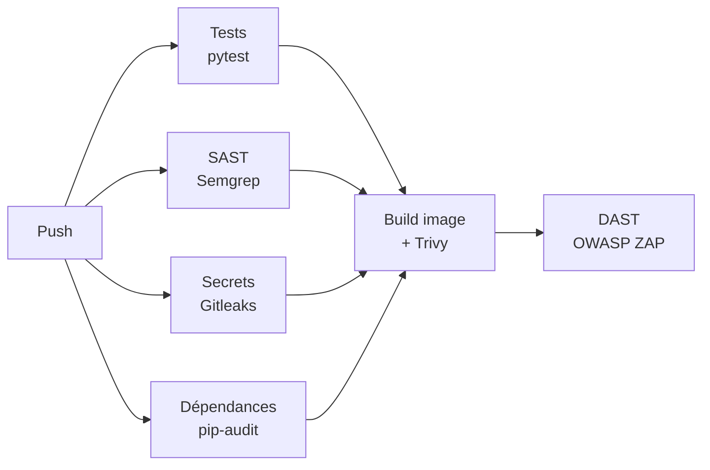
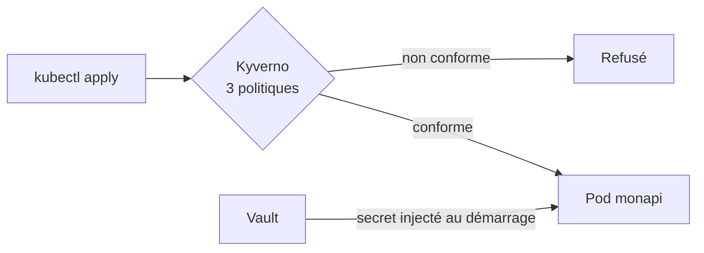

# Pipeline DevSecOps — API Flask sur Kubernetes

Projet d'apprentissage : faire évoluer une petite API Flask **volontairement vulnérable** vers une chaîne DevSecOps complète, avec des contrôles de sécurité automatisés à chaque étape (code, dépendances, image, cluster, application en fonctionnement).

> ⚠️ La version initiale (v0, commit `7f1bf2e`) contient des failles **volontaires** (injection SQL, secret en dur, image obsolète en root…) pour mesurer l'apport de chaque contrôle. Vault tourne en **mode dev**. Ce dépôt est une démonstration, pas une configuration de production.

## Pipeline



- Les 4 contrôles du code tournent **en parallèle** ; l'image n'est construite que s'ils passent tous.
- Chaque outil peut **bloquer** le pipeline ; Trivy, Semgrep et Gitleaks publient leurs résultats (SARIF) dans l'onglet *Security*, ZAP publie son rapport en artefact.

Côté cluster (kind) :



## Résultats

**Image Docker (Trivy)**

| Version | Changement | CRITICAL | HIGH | Total | Taille |
|---|---|---:|---:|---:|---:|
| v0 | `python:3.9`, root | **234** | 1 988 | 11 056 | 1,1 Go |
| v1 | `python:3.13-slim`, multi-stage, non-root | 0 | 49 | 175 | 125 Mo |
| v2 | dépendances à jour (Flask 3…) | 0 | 46 | 159 | 126 Mo |
| v3 | pip retiré de l'image finale | **0** | **44** | **156** | 130 Mo |

Les 44 HIGH restantes concernent des paquets Debian de base **sans correctif publié** (risque accepté, voir les limites).

**Code et application**

| Contrôle | Avant | Après |
|---|---|---|
| Semgrep (SAST) | 4 alertes (injection SQL, `debug=True`, `0.0.0.0`) | 0 |
| pip-audit | 4 paquets, 19 avis | 0 |
| Gitleaks | 1 secret dans l'historique | traité (rotation + `.gitleaksignore` justifié) |
| OWASP ZAP (DAST) | injection SQL **High** détectée sur la v0 | 0 alerte bloquante |
| Kyverno | — | déploiement non conforme refusé |
| Secrets | Secret Kubernetes commité (base64) | servi par Vault, plus aucun secret dans Git |

## Outils

| Domaine | Outil | Version |
|---|---|---|
| Application | Python / Flask / gunicorn | 3.13 / 3.1.3 / 26.2.0 |
| Scan d'image | Trivy (`aquasecurity/trivy-action`) | v0.36.0 |
| SAST | Semgrep | 1.178.0 |
| Secrets | Gitleaks | 8.30.1 |
| Dépendances | pip-audit | 2.10.1 |
| DAST | OWASP ZAP | 2.17.0 |
| Cluster local | kind / Kubernetes | 0.33.0 / 1.37 |
| Politiques | Kyverno | 1.19.1 (chart 3.9.1) |
| Secrets | HashiCorp Vault | 2.0.4 (chart 0.34.1) |

## Structure

```
app.py                  API Flask (notes, SQLite)
tests/                  tests pytest (dont non-régression injection SQL)
Dockerfile              image multi-stage, non-root, sans pip
openapi.yaml            description de l'API (utilisée par ZAP)
.github/workflows/      pipeline CI
.gitleaksignore         secret historique traité, justifié
.zap/rules.tsv          décisions ZAP (FAIL / IGNORE / INFO), justifiées
k8s/                    Deployment durci, Service, ServiceAccount
policies/               politiques Kyverno (ValidatingPolicy, CEL)
tests/k8s/              déploiement non conforme pour la démonstration
vault/                  valeurs Helm et script de configuration de Vault
```

## Lancer le projet

Prérequis : Docker, kind, kubectl, Helm.

```bash
# Cluster et image
kind create cluster --name devsecops
docker build -t monapi:v5 .
kind load docker-image monapi:v5 --name devsecops

# Kyverno + politiques
helm repo add kyverno https://kyverno.github.io/kyverno/
helm install kyverno kyverno/kyverno -n kyverno --create-namespace --version 3.9.1 \
  --set backgroundController.enabled=false \
  --set cleanupController.enabled=false \
  --set reportsController.enabled=false --wait
kubectl apply -f policies/

# Vault (mode dev) puis configuration
helm repo add hashicorp https://helm.releases.hashicorp.com
helm install vault hashicorp/vault -n vault --create-namespace --version 0.34.1 \
  -f vault/values.yaml --wait
kubectl exec -n vault -i vault-0 -- sh < vault/configure-vault.sh

# Application
kubectl apply -f k8s/
kubectl port-forward deploy/monapi 8080:5000
curl localhost:8080/health
```

Démonstration Kyverno :

```bash
kubectl apply -f tests/k8s/deploiement-non-conforme.yaml   # refusé par les 3 politiques
```

## Choix techniques

- **kind** : un vrai cluster Kubernetes en local, sans coût cloud.
- **Mesurer avant de corriger** : chaque correction est mesurée par rapport à la v0.
- **Actions GitHub épinglées par SHA** et binaires téléchargés avec **vérification SHA-256** (Gitleaks) : on exécute exactement ce qu'on a vérifié.
- **Barrière Trivy sur les CRITICAL corrigeables** (`ignore-unfixed`) : on bloque ce qui est actionnable, le reste reste visible dans l'onglet *Security*.
- **Kyverno `ValidatingPolicy` (CEL)** plutôt que `ClusterPolicy`, dépréciée depuis Kyverno 1.19 ; `failurePolicy: Fail` (on privilégie la sécurité à la disponibilité).
- **Système de fichiers en lecture seule** : seuls `/tmp`, `/app/data` et `/home/appuser` sont inscriptibles.
- **Vault avec authentification Kubernetes** : un ServiceAccount dédié, une politique en lecture seule sur un seul chemin, un jeton de 10 minutes ; agent en mode « init seulement » (secret statique, économie de mémoire).
- **ZAP avec OpenAPI** : un scan « baseline » ne trouvait que 3 URLs sur une API JSON ; avec la description OpenAPI, 34 URLs et un scan actif.

## Limites et améliorations

- **Vault en mode dev** (jeton root connu, HTTP, stockage en mémoire) → en production : TLS, stockage Raft, déverrouillage par KMS, audit.
- **Réseau plat** (aucune NetworkPolicy) : tout pod peut joindre Vault et l'API → NetworkPolicy, mTLS (service mesh).
- **44 HIGH Debian sans correctif** → image distroless.
- **Image reconstruite dans chaque job** → publication sur GHCR, signature Cosign.
- **Rapports Kyverno désactivés** (mémoire) → activer le reports-controller ; tester les politiques avec la CLI Kyverno dans la CI.
- **API sans authentification ni TLS** → authentification applicative, Ingress avec TLS.

Les rapports de scan détaillés sont régénérables localement (dossier `scans/`, non versionné).
